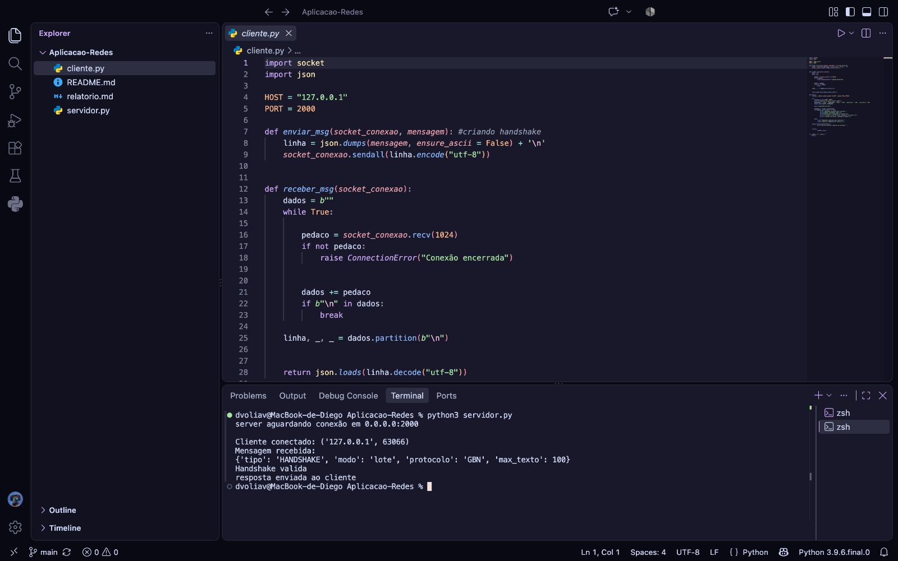
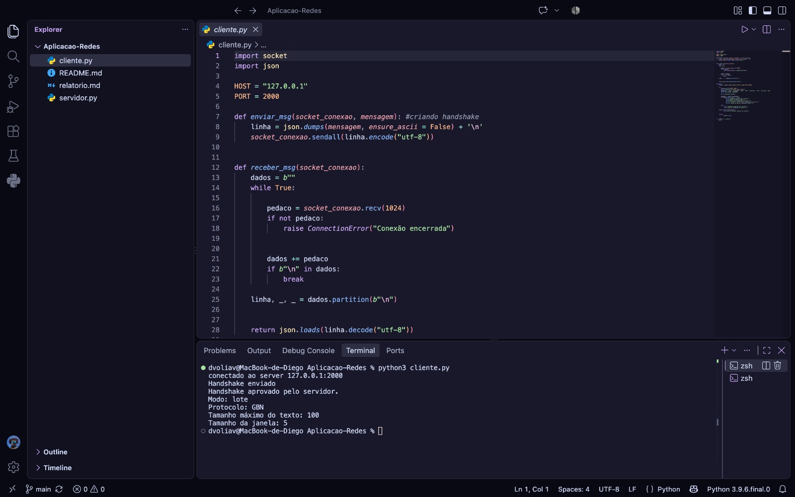

````markdown
## Checkpoint 1 – Handshake e Sockets

**Alunos:** Felipe Lemos, Diego Gomes, Natan Luís, Sophia Brito, Felipe Braz, Mariana Maliu, Arthur Coelho, Daniel Bezerra e Luana Fernandes

---

## 1. Introdução

Neste primeiro checkpoint, nosso objetivo foi criar a comunicação básica entre um cliente e um servidor utilizando sockets e implementar o processo inicial de handshake.

A ideia é que o cliente envie as informações necessárias para iniciar a comunicação e que o servidor verifique se esses parâmetros são válidos. Se estiver tudo certo, o servidor confirma o handshake e informa a configuração que será utilizada.

---

## 2. Comunicação entre Cliente e Servidor

A comunicação foi implementada em Python utilizando a biblioteca `socket`.

O servidor utiliza a porta **2000** e fica aguardando conexões. O cliente se conecta utilizando o endereço `127.0.0.1`, permitindo que os testes sejam realizados localmente.

As mensagens são enviadas em formato **JSON**, utilizando `\n` para indicar o final de cada mensagem.

O fluxo básico ficou:

**Cliente → Servidor:** conexão + `HANDSHAKE`

**Servidor → Cliente:** `HANDSHAKE_ACK`

---

## 3. Handshake

O handshake foi criado para que o cliente e o servidor possam definir os parâmetros iniciais da comunicação.

O cliente envia:

- **Modo:** lote ou individual;
- **Protocolo:** GBN ou SR;
- **Tamanho máximo do texto:** atualmente 100 caracteres.

No código atual, o cliente envia:

```text
tipo: HANDSHAKE
modo: lote
protocolo: GBN
max_texto: 100
````

Ao receber essas informações, o servidor verifica se o modo e o protocolo são válidos e se o tamanho máximo do texto é de pelo menos **30 caracteres**.

A janela é definida pelo servidor e, nesta primeira implementação, começa com o valor **5**.

Quando o handshake é aceito, o servidor envia uma resposta com o status e os parâmetros definidos para a comunicação.

### Teste 1 – Servidor recebendo e validando o handshake



---

### Teste 2 – Cliente recebendo a confirmação



---

## 4. Evolução da Implementação

O desenvolvimento foi feito aos poucos, adicionando e testando cada parte antes de seguir para a próxima etapa.

| Etapa | Implementação                                                                                      |
| ----- | -------------------------------------------------------------------------------------------------- |
| 1     | Criação da comunicação básica entre cliente e servidor utilizando sockets TCP.                     |
| 2     | Implementação do envio e recebimento de mensagens em JSON.                                         |
| 3     | Criação e validação do handshake.                                                                  |
| 4     | Ajuste da negociação da janela para que ela seja definida pelo servidor, inicialmente com valor 5. |

---

## 5. Processo de Construção e Uso de IA

Durante o desenvolvimento, utilizamos inteligência artificial como apoio para entender alguns conceitos e resolver dúvidas que surgiram durante a implementação.

A IA foi utilizada principalmente para auxiliar na comunicação com sockets, na estrutura das mensagens e na criação e validação do handshake.

As sugestões recebidas foram testadas no código.

### Principais pontos em que a IA foi utilizada

* Estrutura básica da comunicação cliente-servidor;
* Funcionamento de `socket`, `sendall()` e `recv()`;
* Organização das mensagens em JSON;
* Estrutura do handshake;
* Validação dos parâmetros recebidos;
* Identificação e correção de problemas durante os testes.

### Prompts utilizados

1. Como começo a fazer a comunicação entre o cliente e o servidor usando socket em Python?
2. Nesse código, como funciona o socket e qual a diferença entre sendall e recv?
3. Como eu posso organizar as mensagens que vou trocar entre cliente e servidor usando JSON?
4. Como posso fazer um handshake para o cliente enviar as informações iniciais para o servidor?
5. Como faço para o servidor verificar se as informações que recebeu no handshake estão corretas?
6. Pode olhar esse código e me dizer onde está o problema? O cliente não está conseguindo receber a resposta do servidor
7. Como faço para a janela ser definida pelo servidor e enviada de volta para o cliente?
8. Testei o cliente e o servidor, mas quero saber se o handshake está funcionando como deveria. O que preciso verificar?

---

## 6. Conclusão

Neste checkpoint, conseguimos implementar a comunicação entre o cliente e o servidor e realizar o handshake com os parâmetros definidos. Os testes realizados confirmaram o funcionamento dessa primeira etapa e deixaram a base preparada para o desenvolvimento das próximas partes do trabalho.

```
```
